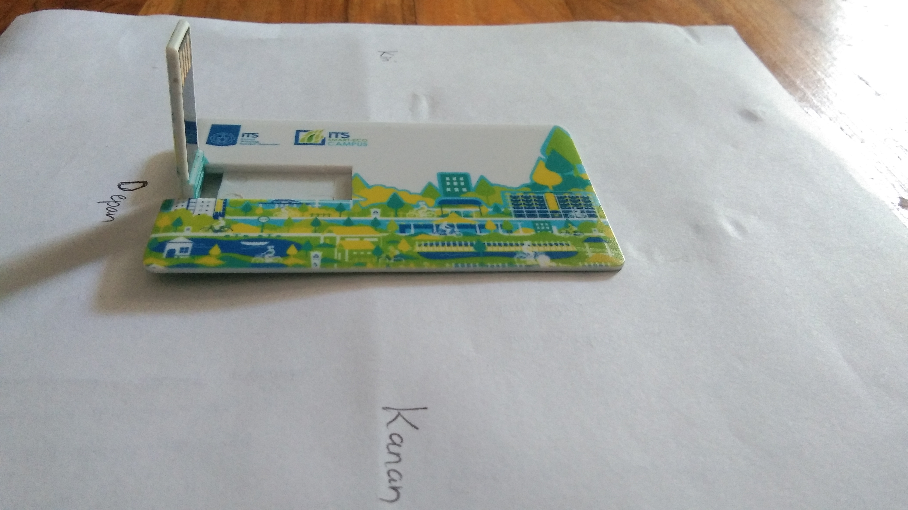
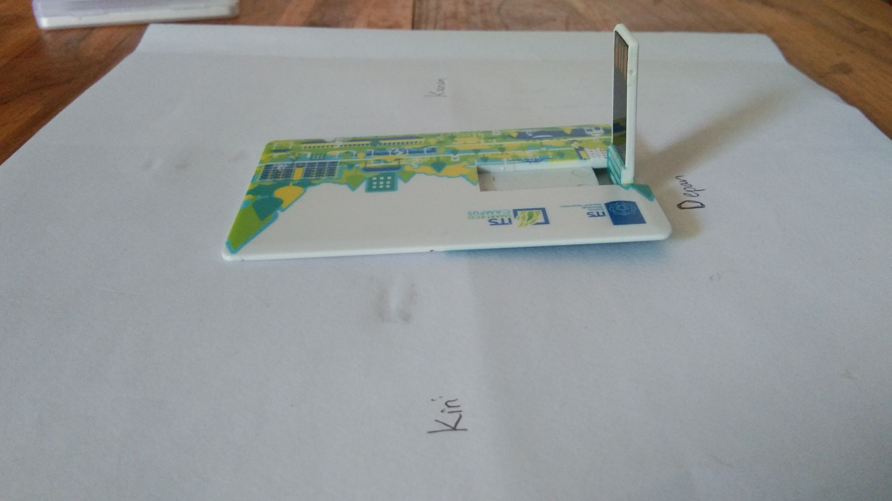
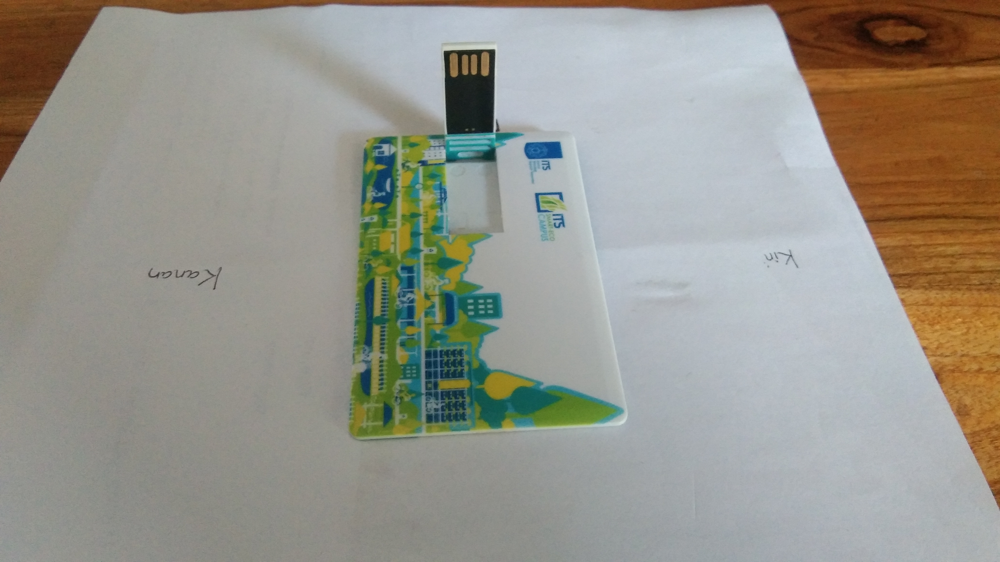
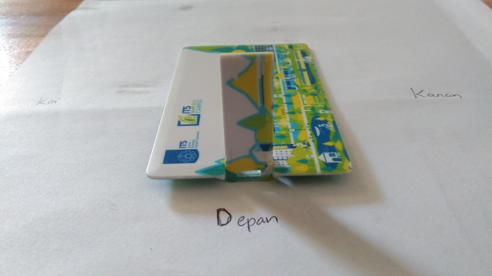

# tugas-1-Cahyadesthian-156
tugas-1-Cahyadesthian-156 created by GitHub Classroom

### Cari benda di sekitar Anda yang berawalan huruf A, F, atau K.
Benda : Flashdisk

### Letakkan benda tersebut di atas permukaan datar: meja, lantai, dsb. Ambil foto benda tersebut dari empat sudut pandang yang berbeda: kanan atas, kiri atas, belakang atas, depan atas (sudut kemiringan bebas).

Kanan Atas          

Kiri Atas       

Belakang Atas       

Depan Atas        

