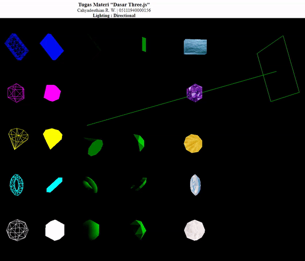

# tugas-1-Cahyadesthian-156
tugas-1-Cahyadesthian-156 created by GitHub Classroom

### Tugas 1
1. Cari benda di sekitar Anda yang berawalan huruf A, F, atau K.
2. Letakkan benda tersebut di atas permukaan datar: meja, lantai, dsb.
3. Ambil foto benda tersebut dari empat sudut pandang yang berbeda: kanan atas, kiri atas, belakang atas, depan atas (sudut kemiringan bebas).
4. Klik URL undangan tugas untuk memulai pembuatan repo tugas Anda di GitHub.
5. Buat sebuah file README.md yang berisikan nama benda berikut empat foto yang telah Anda ambil sebelumnya.
6. Jangan lupa untuk melakukan commit dan push perubahan.
Deadline: Rabu, 2021/09/22, 07.00 AM                  

#### Lanjutan Tugas 1
Membuat sebuah aplikasi Grafika berbasis WebGL pada repo tugas yang telah dibuat di tugas sebelumnya dengan spesifikasi di bawah ini:
1. Aplikasi tersusun atas file-file HTML, JavaScript, dan CSS (opsional).
2. Aplikasi terdiri dari satu Canvas saja.
3. Aplikasi JavaScript mengandung definisi verteks-verteks yang menyusun bentuk dari benda yang difoto pada penugasan sebelumnya: Pilih dua dari empat foto.
4. Definisi verteks mencakup elemen: posisi (x, y) dan warna (r, g, b), sebagaimana tampak pada foto-foto yang telah terpilih.
5. Bentuk sebagaimana tampak pada salah satu foto pilihan digambar di sisi kiri Canvas: Terletak di clip space antara aksis X = -1.0 dan X = 0.0.
6. Bentuk sebagaimana tampak pada satu foto pilihan lainnya digambar di sisi kanan Canvas: Terletak di clip space antara aksis X = 0.0 dan X = 1.0.
7. Hasil gambar pada Canvas sebelah kanan dianimasikan secara vertikal, memantul-mantul di antara dinding atas dan bawah Canvas, dengan kecepatan 0.0xxx unit, di mana xxx adalah tiga digit terakhir NRP.
8. Jangan lupa untuk melakukan commit dan push perubahan.
Deadline: Rabu, 2021/10/06, 07.00 AM

### Tugas Materi Dasar-dasar Three.js
Tugas Individu (waktu 1 pekan)
1. Buat dan tampilkan beberapa geometri dan diberi animasi, beberapa obyek ditampilkan wireframe
2. Gunakan beberapa jenis material 
3. gunakan beberapa jenis lighting (AmbientLight, HemisphereLight, DirectionalLight, PointLight, Spotlights)
.             

Pada pengerjaan tugas ini, beberapa gemoetri yang digunakan adalah kubus/box,sphere,cone,torus, dan octahderon.
Material yang digunakan adalah MeshBasicMaterial, MeshLambertMaterial, dan MeshPongMaterial. Poperties yang digunakan diantaranya adalah color, wireframe, texture, flatshading, dan shininess dengan material yang bersesuaian
Light yang digunakan AmbientLight, HemisphereLight, DirectionalLight, PointLight, Spotlights dengan beberapa properties yang digunakan diantaranya adalah posisiton dan Helper bagi beberapa lighting yang bersesuaian. Setiap lighting diterapkan dalam file yang terpisah     
    

